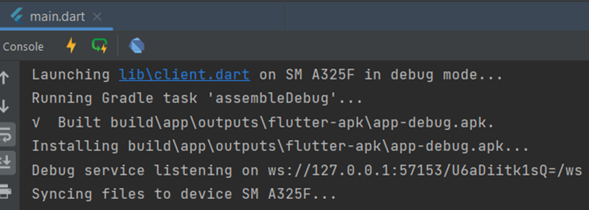
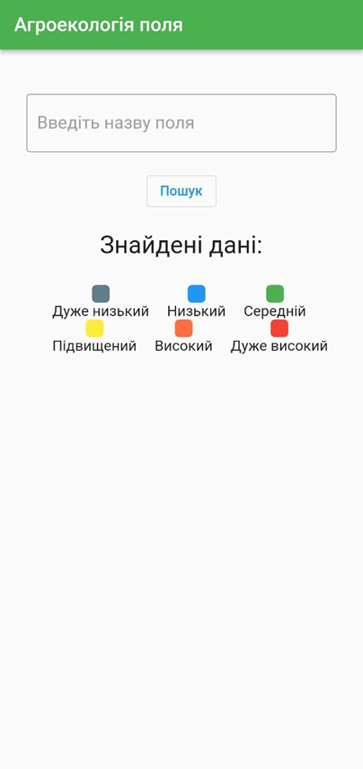
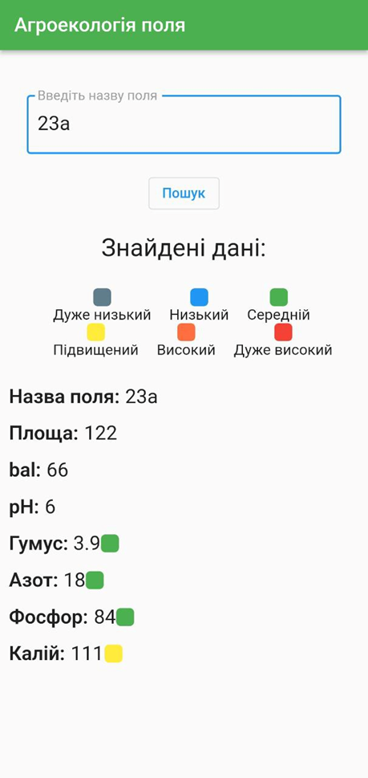

# Flutter gRPC App

This is an app that demonstrates the creation and usage of client-server architecture(dart-server and flutter-client)

## Getting Started

### Packages:
- grpc: ^3.1.0
- convert: ^3.1.1
- csv: ^5.0.2

### Libraries:
- 'dart:convert';
- 'dart:io';

### Additional requirements:
Protocol Buffer Compiler, source: https://grpc.io/docs/protoc-installation/

## Tutorial

#### 1. Create a .proto-file, where you define interface and messages to share data between server and client:
/server/protos/fields.proto - you can see example on this path

#### 2. Generate dart-code that bases on fields.proto-file using proto-compiler, using a command in terminal:
/*path to protoc.exe*/ --dart_out=grpc:/*path where you want to have compiled files*/ --proto_path=lib /*path to file where you have .proto-file*/
For example, mine is:  
E:\protoc-22.5-win64\bin\protoc.exe --dart_out=grpc:lib/src --proto_path=lib server/protos/fields.proto

#### 3. Create a server-part
For example, your server main-file can be like this:

`Future<void> main() async {` 
`final server = Server([FieldService()]);` 
`await server.serve(port: 8080);` 
`print('Server listening on port ${server.port}');` 
`}` 

(You can search for details for this clause in my lib/server/ directory)

#### 4. Create a client
Your client need to connect to your server, so here is the function:

`Future<FieldResponse> getFields(String value) async {`   
`final channel = ClientChannel('000.000.0.0',` //your host 
`port: 8080,`  
`options: const ChannelOptions(credentials: ChannelCredentials.insecure()));`  
`final client = FieldServiceClient(channel);`  
`final request = FieldRequest()..data = value;`  
`final response = await client.getFields(request);`  
`await channel.shutdown();`  
`return response;`  
`}`  
Note!!! If you are running this app on emulator, you can write 'localhost' instead of '000.000.0.0'. But if you are running it on device - you should write your host(you can find it while writing `ipconfig` in your terminal)

#### 5. Create connection to server

In my code I connect to server when user presses the button:

`OutlinedButton(onPressed: () async{`` 
`final response = await getFields(_controller.text); //exactly this line`` 
`final splitData = response.message.split('\n');`` 
`setState(() {`` 
`data = splitData;`` 
`});`` 

## Run

First run server part in first terminal-window:

PS C:\Users\User\StudioProjects\fields_grcp> dart lib/server/main_server.dart  

Then run client part as you usually do (Android Studio - Shift+F10 or just press green button)

## Screenshots

Running server:

Running client:

UI:

